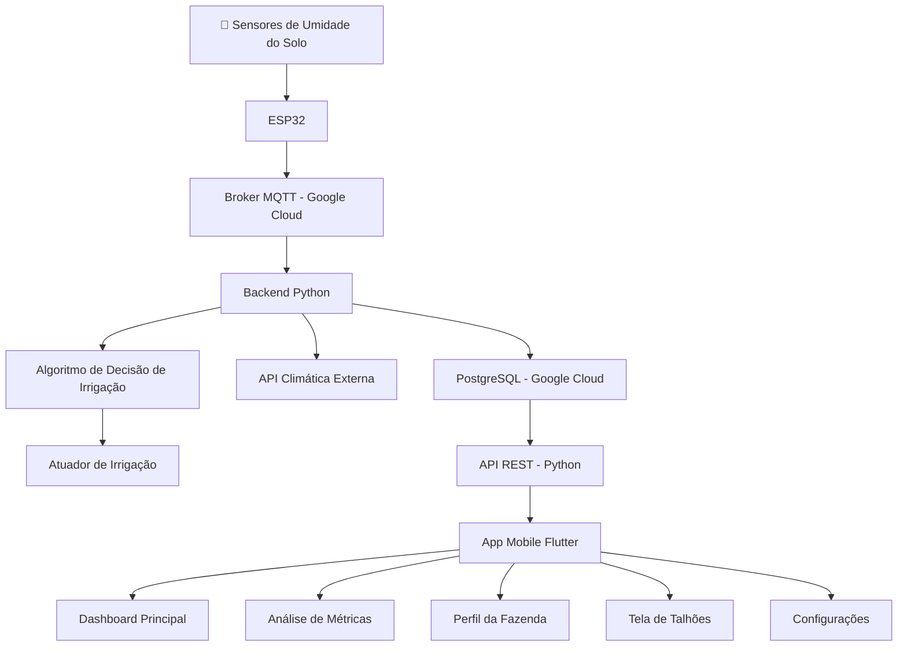

# Arquitetura Geral do Sistema
## Sistema Inteligente para o Agronegócio — PI3
**Instituição:** SENAI Gaspar Ricardo Junior  
**Empresa Parceira:** AgroTech Goiás  
**Turma:** 3º Semestre — Tecnologia da Informação

---

## 1. Visão Geral

O sistema é composto por quatro camadas principais integradas entre si:

- **Camada IoT** — coleta de dados físicos do campo
- **Camada Backend** — processamento, lógica e exposição de dados
- **Camada Cloud** — infraestrutura, armazenamento e disponibilidade
- **Camada Mobile** — interface de monitoramento e controle para o agricultor

---

## 2. Diagrama de Fluxo Técnico



---

## 3. Fluxo de Dados Descritivo

```
Sensor de Umidade do Solo
        ↓
    ESP32 (coleta e publica via MQTT)
        ↓
Broker MQTT (Google Cloud)
        ↓
Backend Python (recebe, processa, decide)
        ↓         ↓
  PostgreSQL    Algoritmo de Irrigação
  (armazena)    (aciona/desliga atuador)
        ↓
    API REST (expõe dados)
        ↓
  App Mobile Flutter
  (visualiza e controla)
```

---

## 4. Descrição das Camadas

### 4.1 Camada IoT
Responsável pela coleta dos dados físicos do campo e envio ao servidor.

| Componente | Descrição |
|---|---|
| **Sensor de Umidade** | Coleta umidade do solo em tempo real |
| **ESP32** | Microcontrolador que lê o sensor e publica via MQTT |
| **Protocolo MQTT** | Protocolo leve de mensageria para IoT |
| **Tópicos MQTT** | Padrão: `agro/solo/umidade`, `agro/solo/temperatura` |

**Responsável:** Kelvim

---

### 4.2 Camada Backend
Responsável pelo processamento dos dados, lógica de negócio e exposição via API.

| Componente | Tecnologia | Descrição |
|---|---|---|
| **Linguagem** | Python | Desenvolvimento do servidor e algoritmos |
| **API REST** | Python (FastAPI ou Flask) | Exposição dos dados ao app mobile |
| **Broker MQTT** | Mosquitto / Google Cloud IoT | Recebe publicações do ESP32 |
| **Algoritmo de Decisão** | Python | Define quando acionar/desligar irrigação |
| **Autenticação** | JWT | Controle de acesso à API |
| **API Climática** | Externa (OpenWeather ou similar) | Dados de temperatura, umidade do ar e previsão de chuva |

**Responsável:** Kelvim (IoT/Backend) + Gustavinho (API REST)

---

### 4.3 Camada Cloud
Responsável pela infraestrutura, disponibilidade e armazenamento persistente dos dados.

| Componente | Tecnologia | Descrição |
|---|---|---|
| **Plataforma** | Google Cloud Platform (GCP) | Hospedagem de todos os serviços |
| **Banco de Dados** | PostgreSQL | Armazenamento de leituras, usuários, logs e alertas |
| **Servidor de Aplicação** | Google Cloud Run / VM | Hospedagem do backend Python |
| **Broker MQTT** | Google Cloud IoT / Mosquitto | Recepção das mensagens IoT |
| **Segurança** | Variáveis de ambiente | Credenciais protegidas fora do código |
| **Backup** | Google Cloud Storage | Backup automático do banco de dados |

**Responsável:** Senna

---

### 4.4 Camada Mobile
Responsável pela interface de monitoramento e controle remoto pelo agricultor.

| Componente | Tecnologia | Descrição |
|---|---|---|
| **Framework** | Flutter | Desenvolvimento cross-platform (Android/iOS) |
| **Linguagem** | Dart | Linguagem base do Flutter |
| **Comunicação** | HTTP/REST | Consumo da Rest API|
| **Autenticação** | JWT | Login seguro e controle de sessão |

**Telas do aplicativo:**
- Login e Cadastro
- Dashboard Principal (Home)
- Análise de Métricas
- Perfil da Fazenda
- Tela de Talhões
- Configurações da Fazenda

**Responsável:** Gustavinho

---

## 5. Papéis e Responsabilidades

| Membro | Papel Scrum | Responsabilidade Técnica |
|---|---|---|
| **Kelvim** | Dev Team | IoT, ESP32, MQTT, Backend Python, Algoritmo de Decisão |
| **Gustavinho** | Dev Team | API REST, App Mobile Flutter, UI/UX |
| **Senna** | Dev Team | Infraestrutura Google Cloud, PostgreSQL, integração backend/nuvem |
| **Ryan** | Scrum Master | Gestão do backlog, IVH, documentação, artigo científico |
| **AgroTech Goiás** | Product Owner | Validação de requisitos e priorização |

---

## 6. Decisões Técnicas

| Decisão | Escolha | Justificativa |
|---|---|---|
| **Microcontrolador** | ESP32 | Wi-Fi nativo, suporte a MQTT, baixo custo, disponível no mercado nacional |
| **Protocolo IoT** | MQTT | Leve, eficiente para redes instáveis, padrão da indústria para IoT |
| **Backend** | Python | Versatilidade, vasta biblioteca para IoT e dados, curva de aprendizado acessível |
| **Banco de dados** | PostgreSQL | Relacional, robusto, gratuito, suporte nativo no Google Cloud |
| **Cloud** | Google Cloud Platform | Tier gratuito generoso, integração com IoT, confiabilidade |
| **Mobile** | Flutter | Cross-platform (Android e iOS), alta performance, UI rica |
| **Autenticação** | JWT | Stateless, seguro, compatível com REST APIs |
| **API Climática** | Externa (OpenWeather) | Dados confiáveis de temperatura, umidade e previsão de chuva |

---

## 7. Integrações entre Camadas

| Integração | Protocolo | Direção |
|---|---|---|
| ESP32 → Broker MQTT | MQTT | IoT → Cloud |
| Broker MQTT → Backend | MQTT Subscribe | Cloud → Backend |
| Backend → PostgreSQL | SQL | Backend → Cloud |
| Backend → API Climática | HTTP/REST | Backend → Externo |
| Backend → App Mobile | HTTP/REST + JWT | Backend → Mobile |
| App Mobile → Backend | HTTP/REST + JWT | Mobile → Backend |

---

## 8. Repositório

**GitHub:** `RyanALO/PI3-Sistema-Inteligente-para-o-Agronegocio`

**Estrutura de branches sugerida:**
```
main          → produção estável
dev           → desenvolvimento integrado
feature/iot   → Kelvim
feature/api   → Gustavinho
feature/cloud → Senna
feature/mobile→ Gustavinho
docs/         → Ryan
```

---

*Documento gerado para a Entrega 1 do PI3 — Arquitetura e Problemática*  
*SENAI Gaspar Ricardo Junior — 2025*
