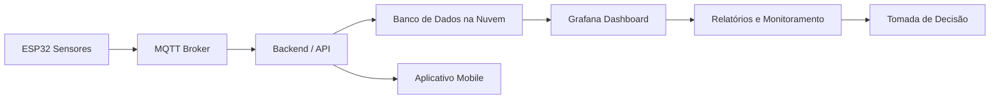

#  Mapa de Integração Vertical e Horizontal

## 1. Objetivo
Representar a integração vertical e horizontal da arquitetura do Projeto Integrador
Mutidiciplinar 3 com o tema de Sistema Inteligente para o Agronegóci0, considerando:

 - ESP32
 - Sensores
 - Backend
 - Nuvem
 - Aplicação Mobile

 ## 2. Conceito Aplicado

 ### Integração Vertical
 Fluxo entre níveis hierárquicos:

- Sensor coleta dado
- Backend processa
- Visualização Mobile

### Integração Horizontal
Integração entre sistemas no mesmo nível:

- ESP32 ↔ Backend
- Backend ↔ Nuvem
- ESP32 ↔ MQTT 
- Mobile ↔ Backend
- Mobile ↔ Nuvem

## 3. Diagrama em Mermaid

## Explicação do Fluxo

1. ESP32 coleta dados de sensores.
2. Os dados são enviados via MQTT.
3. O Backend recebe e processa os dados.
4. Os dados são armazenados em um banco na nuvem.
5. O Grafana cria dashboards com os dados.
6. O mobile pode acessar o backend para visualizar informações.
7. Os dashboards geram relatórios para análise e tomada de decisão.
