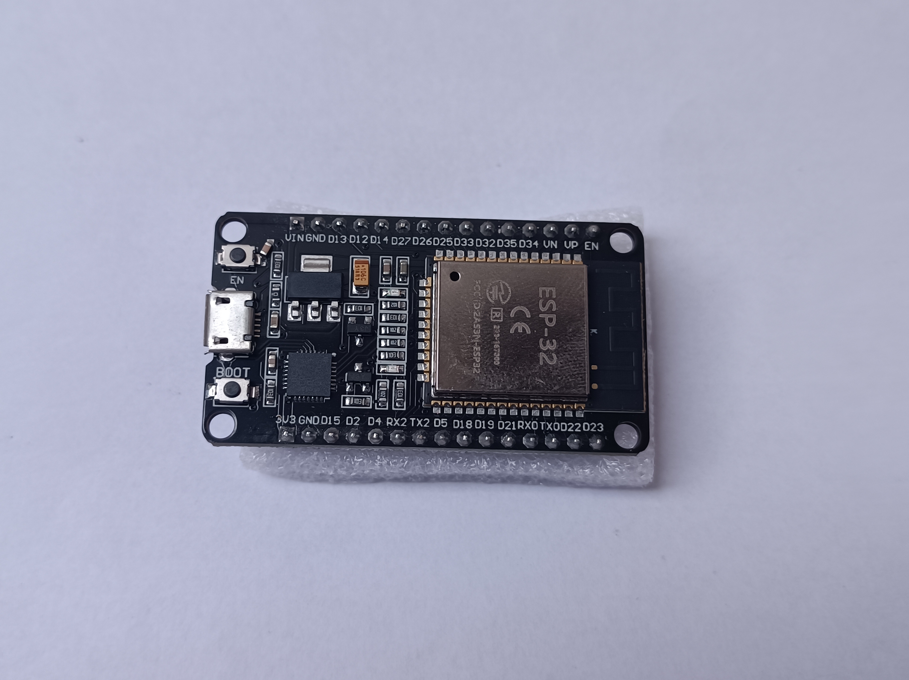
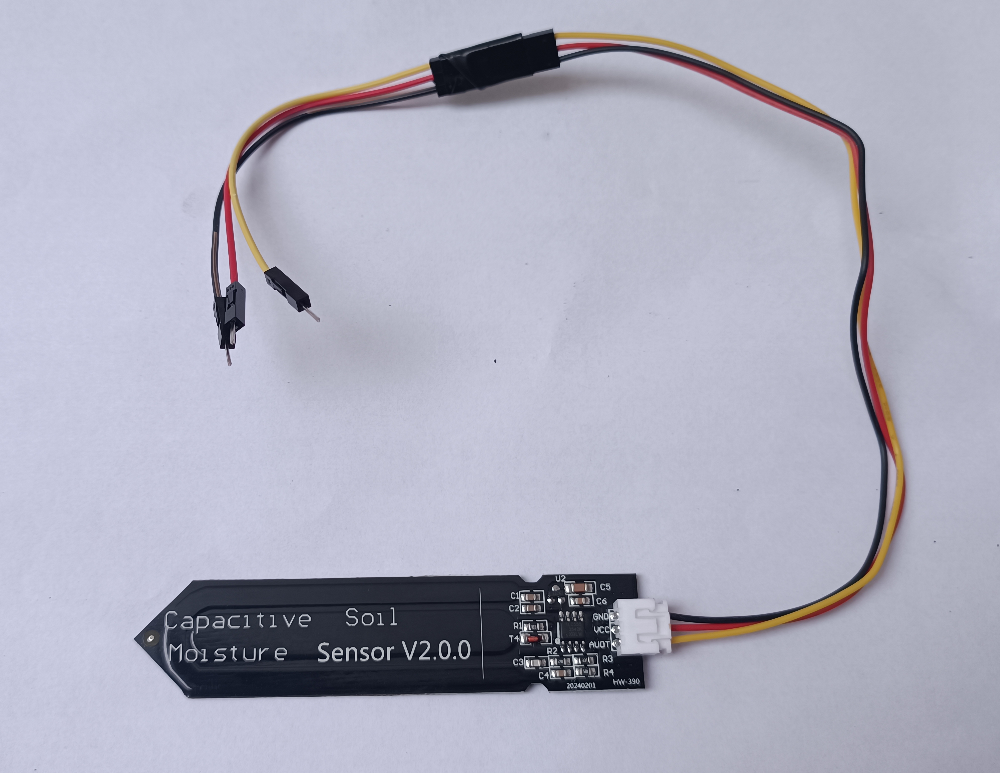
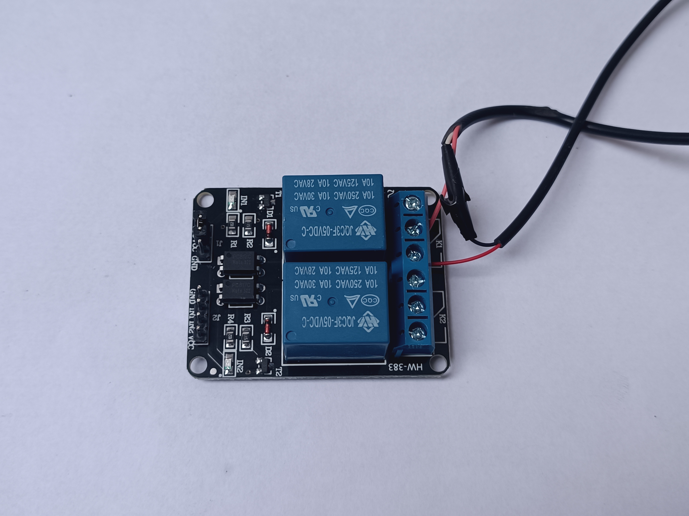
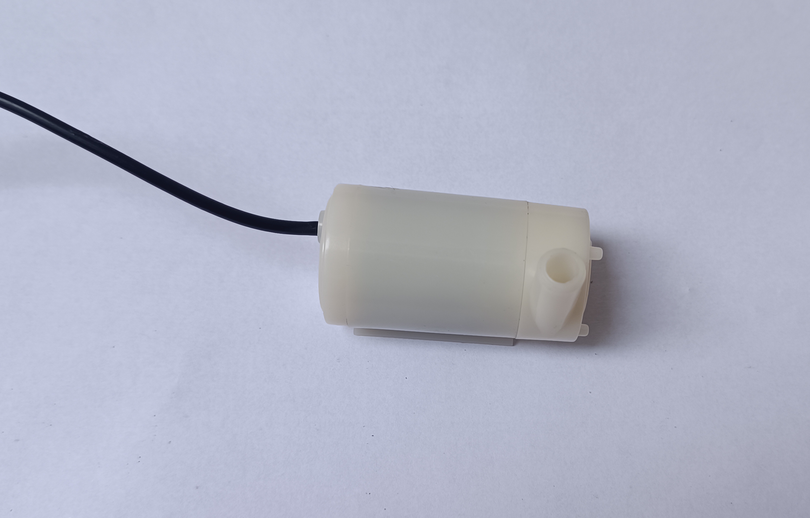
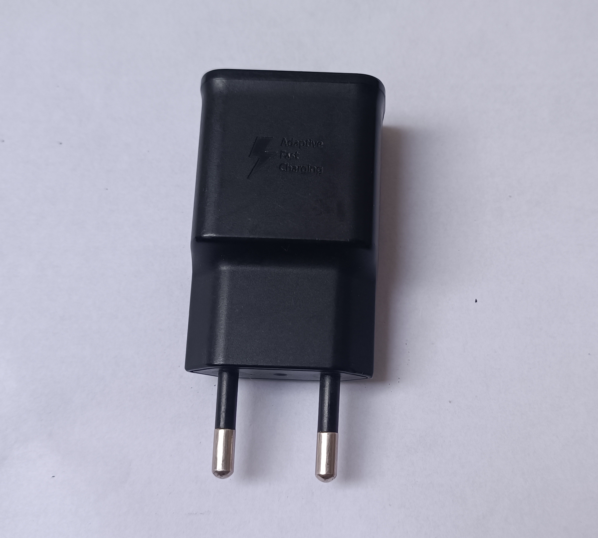
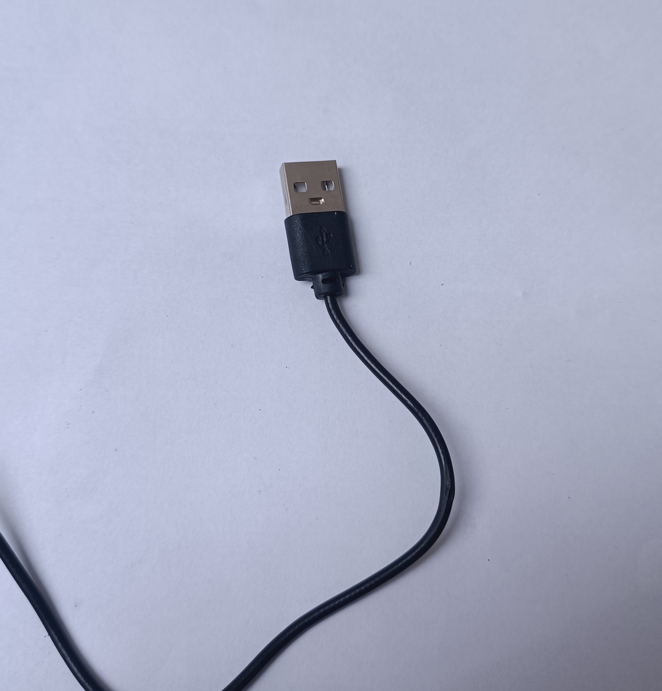
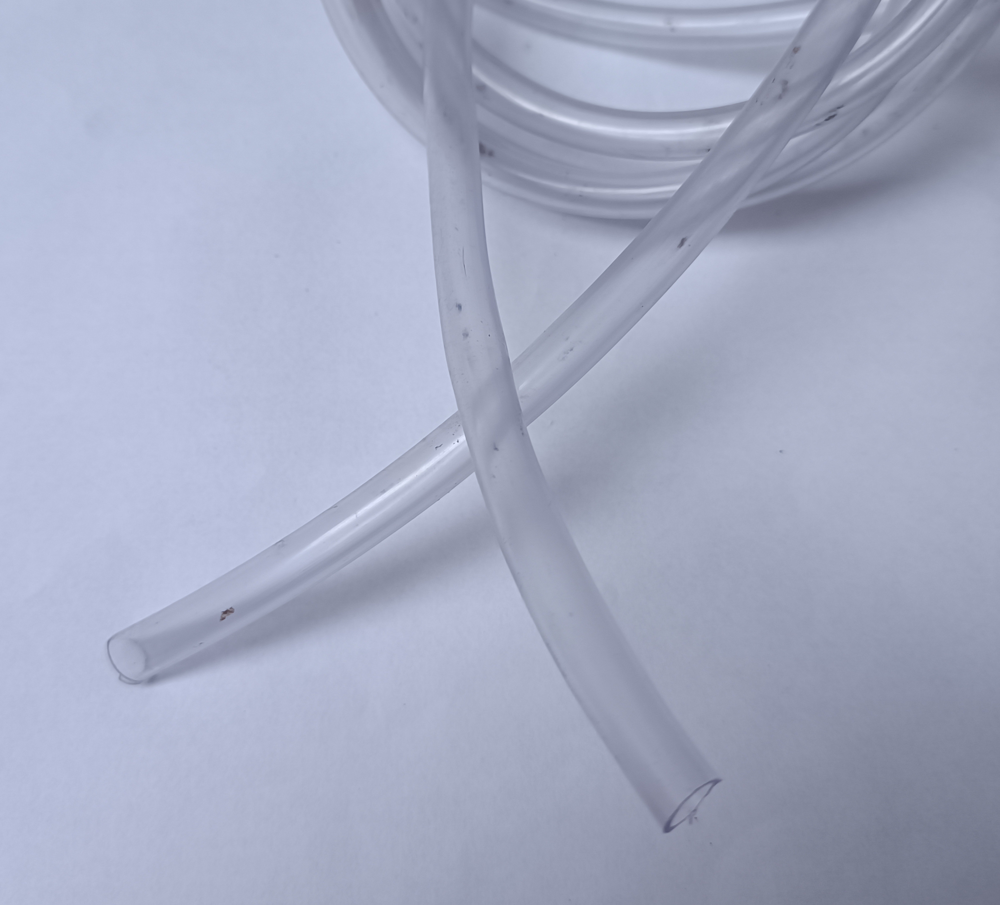

Essa pasta e para fazer o acompanhamento da parte de iot do projeto integrador interdiciplinar3 com o tema de Agronegocio.

# Componentes comprados:

## [ESP32](https://www.wjcomponentes.com.br/esp-32) - R$ 28,77 (WJ Componentes Eletronicos)

Dados Técnicos:

- CPU: Xtensa® Dual-Core 32-bit LX6
- ROM: 448 KBytes
- RAM: 520 Kbytes
- Flash: 4 MB
- Clock máximo: 240MHz
- Wireless padrão 802.11 b/g/n
- Conexão Wifi 2.4Ghz (máximo de 150 Mbps)
- Antena embutida
- Conector micro-usb
- Wi-Fi Direct (P2P), P2P Discovery, P2P Group Owner mode e P2P Power Management
- Modos de operação: STA/AP/STA+AP
- Bluetooth BLE 4.2

Possui ADC (conversor analógico digital) de 18 canais com resolução de 12 bits

Possui 2 DAC (conversor digital analógico) com resolução de 8 bits
- GPIO com funções de PWM, I2C, SPI, etc
- Tensão de Alimentação: 4,5 - 9V
- Taxa de transferência: 110-460800bps
- Suporta Upgrade remoto de firmware
- Conversor analógico digital (ADC)
- Distância entre pinos: 2,54mm
- Dimensões: 49 x 25,5 x 7 mm

## [Sensor de Umidade do Solo Capacitivo (V2.0)](https://shopee.com.br/Sensor-Capacitivo-de-Umidade-do-Solo-i.1562097662.23598683531) - 17,90 (SHOPPE)

- Tensão de Operação: 3.3 – 5 V
- Saída Analógica (0 a 3 V)
- Fácil instalação
- Dimensões: 23 mm × 98 mm x 4 mm
- Comprimento Cabo: 20 cm

## [Módulo Relé 2 Canais 5V com Optoacoplador](https://www.wjcomponentes.com.br/2-canais) - R$ 10,69 (WJ Componentes Eletronicos)

Especificações:
 
- Modelo: SRD-05VDC-SL-C

- Tensão de operação: 5VDC

- Permite controlar cargas de 220V AC

- Corrente típica de operação: 15~20mA

- LED indicador de status

- Pinagem: Normal Aberto, Normal Fechado e Comum

- Tensão de saída: (30 VDC a 10A) ou (250VAC a 10A)

- Furos de 3mm para fixação nas extremidades da placa

- Tempo de resposta: 5~10ms

- Dimensões: 51 x 38 x 20mm

- Peso: 30g

## [Mini bomba submersível](https://www.wjcomponentes.com.br/motores/mini-bomba-submersivel) - R$ 6,98 (WJ Componentes Eletronicos)

A mini bomba é indicada para ser utilizada em projetos como:

- Sistema de irrigação automática;
- Automação residencial (domótica);
- Carrinhos robôs bombeiros;
- Robôs hidráulicos;
- Aquários
- Hidroponia

 
Dados Técnicos:

- Modelo: JT100;
- Tensão: 2,5 – 6VDC (recomendável: 5VDC);
- Corrente de trabalho: 130-220mA;
- Potência: 0,4-1,5W;
- Submersão máxima recomendada: 1m;
- Peso: 26g;
- Vazão: 80 a 120L/H
- Comprimento do fio: 15 a 20cm;
- Diâmetro de entrada: ~3,3mm;
- Diâmetro de saída: ~4,5mm;
- Dimensões: 43,5 x 23 x 30mm;

## Fonte e Cabo USB - USADOS - R$0,00

## Mangueira Transparente 6mm - Doado

2x kit 10 jumpers MxM 10cm --> https://www.wjcomponentes.com.br/protoboard/10-jumpers-dupont-mxm-10-cm R$ 1,38

2x kit 10 jumpers Mxf 20cm --> https://www.wjcomponentes.com.br/mxf20cm R$ 0,47

protoboard 830 --> https://www.wjcomponentes.com.br/protoboard-830 R$ 10,19